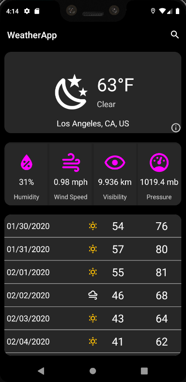
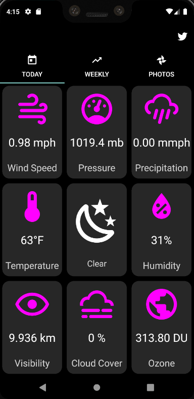
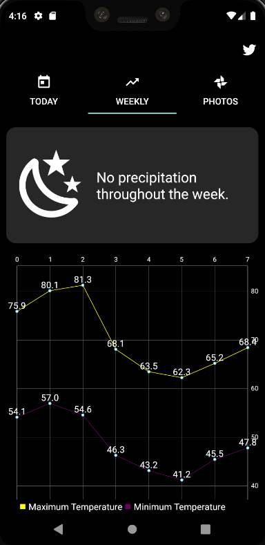
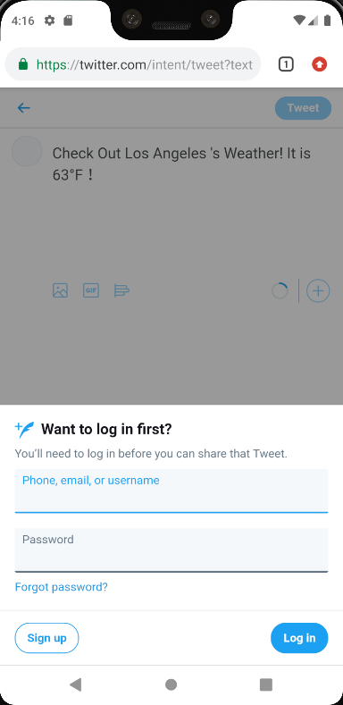
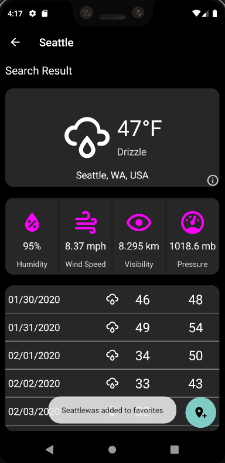

# WeatherSearch
a personal full stack project  
## Server
The server was developed in nodejs/express and deployed on AWS beanstalk.  
## Android Application
1. Default city using current location  

2. Click on the summary card, show the detailed info  

3. Used MPChart to draw the weekly highest and lowest temperature  
 
4. Show views of the city  

5. Can share to Twitter  
  
6. Search a new city and save to favoriate  

